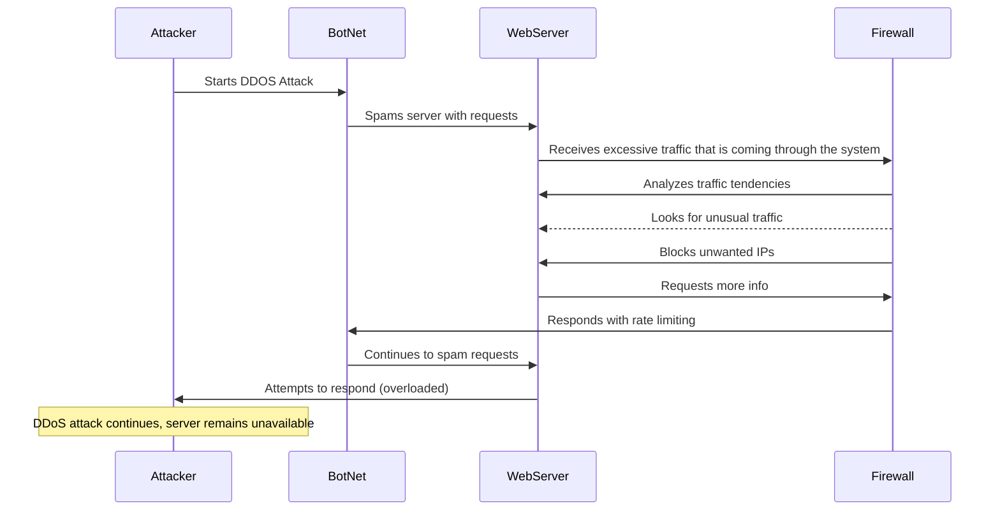

## Attacker
### -This is the person who controls the Botnets and is trying to attack a system. These are usually malicious people who are DDosing a system in order to gain something in return.
## Botnet
### -This is what we call the system that has just been compromised. Once the attacker has control of the Botnet they are able to begin flooding requests to the web server.
## Webserver
### - The webserver that is being attacked will start to try and juggle the thousands of requests that are coming to it through the botnet. The webserver works with the firewall by sending it messages saying it is under strain and by trying to reevaluate the incoming traffic.
## Firewall
### - The firewall is the main level of security when a DDos attack is ocurring. The firewall tries to block incoming traffic that seems malicious. It also tries to limit the ammount of traffic that is coming in to try and prevent the system from overloading.
